# 🌌 Oxide-JS API Documentation Hub

Welcome to the official **Oxide-JS** (formerly **ML-V1**) API Reference and Navigation Hub. Oxide-JS is a high-performance, modular machine learning ecosystem for Node.js and TypeScript, accelerated by a customized **Rust Native Backend** (via napi-rs). 

This portal acts as your interactive navigation map across the three core workspaces of the monorepo:
1. **[@oxide-js/core](file:///home/akhyar/Dokumen/Code/NODE_JS/Oxide-JS/packages/core/src/index.ts)**: Tensor primitives, accelerated math kernels, BPE tokenization, and dynamic Gradient Tape auto-diff.
2. **[@oxide-js/layers](file:///home/akhyar/Dokumen/Code/NODE_JS/Oxide-JS/packages/layers/src/index.ts)**: Standardized, reusable neural network layers (Dense, CNNs, RNNs, self-attention, normalizations, etc.).
3. **[@oxide-js/models](file:///home/akhyar/Dokumen/Code/NODE_JS/Oxide-JS/packages/models/src/index.ts)**: High-level model containers (Sequential, BaseModel), training loops, callbacks, and metrics with Keras/TF.js interoperability.

---

## 🏗️ Monorepo Architecture Blueprint

The following diagram illustrates how the monorepo layers interact, highlighting the zero-copy, highly optimized bridge connecting TypeScript to the raw Rust kernels:

```mermaid
graph TD
    subgraph Client ["Client Space"]
        App["TypeScript App / Training Script"]
    end

    subgraph ModelsPkg ["@oxide-js/models"]
        BaseModel["[BaseModel](file:///home/akhyar/Dokumen/Code/NODE_JS/Oxide-JS/packages/models/src/BaseModel.ts)"]
        Sequential["[Sequential](file:///home/akhyar/Dokumen/Code/NODE_JS/Oxide-JS/packages/models/src/Sequential.ts)"]
        Callbacks["[Callbacks](file:///home/akhyar/Dokumen/Code/NODE_JS/Oxide-JS/packages/models/src/callbacks.ts) (EarlyStopping, etc.)"]
        Metrics["[Metrics](file:///home/akhyar/Dokumen/Code/NODE_JS/Oxide-JS/packages/models/src/metrics.ts) (MSE, accuracy, etc.)"]
    end

    subgraph LayersPkg ["@oxide-js/layers"]
        BaseLayer["[BaseLayer](file:///home/akhyar/Dokumen/Code/NODE_JS/Oxide-JS/packages/layers/src/base/BaseLayer.ts)"]
        Dense["[Dense](file:///home/akhyar/Dokumen/Code/NODE_JS/Oxide-JS/packages/layers/src/layers/Dense.ts)"]
        Embedding["[Embedding](file:///home/akhyar/Dokumen/Code/NODE_JS/Oxide-JS/packages/layers/src/layers/Embedding.ts)"]
        RNNs["[LSTM / GRU / SimpleRNN](file:///home/akhyar/Dokumen/Code/NODE_JS/Oxide-JS/packages/layers/src/layers/LSTM.ts)"]
        Attention["[MultiHeadAttention](file:///home/akhyar/Dokumen/Code/NODE_JS/Oxide-JS/packages/layers/src/layers/MultiHeadAttention.ts)"]
        CNNs["[Conv2D / MaxPooling2D](file:///home/akhyar/Dokumen/Code/NODE_JS/Oxide-JS/packages/layers/src/layers/Conv2D.ts)"]
    end

    subgraph CorePkg ["@oxide-js/core"]
        Matrix["[Matrix](file:///home/akhyar/Dokumen/Code/NODE_JS/Oxide-JS/packages/core/src/matrix/index.ts) (Float32Array-backed)"]
        MJ["[mj](file:///home/akhyar/Dokumen/Code/NODE_JS/Oxide-JS/packages/core/src/math/index.ts) (Math Dispatcher)"]
        Tape["[Tape](file:///home/akhyar/Dokumen/Code/NODE_JS/Oxide-JS/packages/core/src/autodiff/index.ts) (Automatic Differentiation)"]
        Tokenizer["[BPETokenizer](file:///home/akhyar/Dokumen/Code/NODE_JS/Oxide-JS/packages/core/src/tokenizer/index.ts)"]
        Opt["[Optimizers](file:///home/akhyar/Dokumen/Code/NODE_JS/Oxide-JS/packages/core/src/optimizer/index.ts) (Adam, SGD, etc.)"]
        Cost["[Cost Functions](file:///home/akhyar/Dokumen/Code/NODE_JS/Oxide-JS/packages/core/src/cost/index.ts)"]
    end

    subgraph NativeBridge ["oxide-native"]
        NapiBridge["NAPI-RS Native Binding Layer"]
        RayonKernel["Optimized Rust Kernels (Parallel Rayon & MatrixMultiply)"]
    end

    %% Flow of control and data
    App --> BaseModel
    BaseModel --> Sequential
    Sequential --> BaseLayer
    BaseLayer --> Matrix
    BaseLayer --> MJ
    MJ --> NapiBridge
    NapiBridge --> RayonKernel
    Tape --> Matrix
    
    style Client fill:#1a1b26,stroke:#7aa2f7,stroke-width:2px,color:#c0caf5
    style ModelsPkg fill:#1f2335,stroke:#bb9af7,stroke-width:2px,color:#c0caf5
    style LayersPkg fill:#1f2335,stroke:#2ac3de,stroke-width:2px,color:#c0caf5
    style CorePkg fill:#1f2335,stroke:#9ece6a,stroke-width:2px,color:#c0caf5
    style NativeBridge fill:#2e3c43,stroke:#f7768e,stroke-width:2px,color:#c0caf5
```



---

## 🎛️ Workspace 1: `@oxide-js/core`

The core module houses the engine's mathematical core, automatic differentiation tape, and text processing utilities. It exposes standard math kernels that automatically select Rust Native binaries if available, falling back to pure JavaScript.

> **Source Entrypoint**: [packages/core/src/index.ts](file:///home/akhyar/Dokumen/Code/NODE_JS/Oxide-JS/packages/core/src/index.ts)

### 1. `Matrix`
`Matrix` represents the standard N-dimensional numerical container, backed by a flat, high-performance `Float32Array`. It supports zero-copy access via `_data` and tracks mathematical relations for automatic differentiation.
- **Key File**: [packages/core/src/matrix/index.ts](file:///home/akhyar/Dokumen/Code/NODE_JS/Oxide-JS/packages/core/src/matrix/index.ts)
- **Signature Properties**:
  - `_data: Float32Array` - Raw linear memory buffer.
  - `_shape: [number, number]` - Matrix dimensions `[rows, cols]`.
  - `grad: Matrix` - Corresponding gradient values during reverse-mode differentiation.
  - `requiresGrad: boolean` - Directs the Gradient Tape to record calculations.

### 2. `mj` (Math Primitives)
The central dispatch module for array operations. It automatically switches execution between JS Loops and Rust CPU vectors based on availability.
- **Key File**: [packages/core/src/math/index.ts](file:///home/akhyar/Dokumen/Code/NODE_JS/Oxide-JS/packages/core/src/math/index.ts)
- **Primary API Operations**:
  - `mj.dotProduct(a: Matrix, b: Matrix): Matrix` - Accelerated matrix multiplication.
  - `mj.add(a: Matrix, b: Matrix | number): Matrix` - Element-wise addition.
  - `mj.sub(a: Matrix, b: Matrix | number): Matrix` - Element-wise subtraction.
  - `mj.sumAxis(matrix: Matrix, axis: 0 | 1): Matrix` - Vector summation along dimensions.
  - `mj.he(shape: [number, number]): Matrix` - He-normal weight initialization.
  - `mj.xavier(shape: [number, number]): Matrix` - Xavier/Glorot-normal initialization.

### 3. `Tape` & `engine` (Gradient Tape Auto-Diff)
A lightweight tape recorder that performs dynamic automatic differentiation. It works in reverse-mode, tracking execution graphs dynamically to run backward propagation.
- **Key Files**: [packages/core/src/autodiff/index.ts](file:///home/akhyar/Dokumen/Code/NODE_JS/Oxide-JS/packages/core/src/autodiff/index.ts) & [packages/core/src/autodiff/engine.ts](file:///home/akhyar/Dokumen/Code/NODE_JS/Oxide-JS/packages/core/src/autodiff/engine.ts)
- **Usage Pattern**:
  ```ts
  import { Matrix, engine } from "@oxide-js/core";

  const x = Matrix.fromFlat(new Float32Array([2, 3]), [1, 2]);
  x.requiresGrad = true;

  const tape = engine.grad(() => {
    // Record forward steps
    const y = engine.runOperation("square", [x], () => {
      // Forward calculation callback
      return Matrix.fromFlat(new Float32Array([4, 9]), [1, 2]);
    });
    return y;
  });

  tape.backward(tape.result);
  console.log(x.grad._data); // Prints calculated gradients
  ```

### 4. `BPETokenizer`
A fast, customizable Byte-Pair Encoding (BPE) tokenizer featuring fully multilingual and Unicode pre-tokenizers.
- **Key File**: [packages/core/src/tokenizer/index.ts](file:///home/akhyar/Dokumen/Code/NODE_JS/Oxide-JS/packages/core/src/tokenizer/index.ts)
- **Available Pre-Tokenizers**:
  - `char` — Simple, default character segmentation.
  - `unicode-grapheme` — Grapheme-cluster aware segmentation (respects emojis, diacritics).
  - `unicode-word` — Segmenting based on boundary markers.
  - `whitespace` — Word segmentation by spacing.
  - `script-aware` — Advanced multi-lingual tokenization (e.g. separating Arabic, Japanese, Korean, Latin, or Devnagari scripts automatically).

---

## 🔌 Workspace 2: `@oxide-js/layers`

The layers module encapsulates standard machine learning operations into isolated state managers extending `BaseLayer`. It provides modular parameters (`weights` and `biases`) and executes both forward-propagation calculations and backpropagation routines.

> **Source Entrypoint**: [packages/layers/src/index.ts](file:///home/akhyar/Dokumen/Code/NODE_JS/Oxide-JS/packages/layers/src/index.ts)

### The Layer Catalog

| Layer Name | Type | Key Configuration Parameters | Description |
| :--- | :--- | :--- | :--- |
| **[BaseLayer](file:///home/akhyar/Dokumen/Code/NODE_JS/Oxide-JS/packages/layers/src/base/BaseLayer.ts)** | Abstract Base | `name?: string`, `trainable?: boolean` | Structural interface for shapes, weights, state mode, and serialize hooks. |
| **[Dense](file:///home/akhyar/Dokumen/Code/NODE_JS/Oxide-JS/packages/layers/src/layers/Dense.ts)** | Core Layer | `units: number`, `outputUnits: number`, `activation: string` | Feed-forward fully connected layer with custom activations. |
| **[Embedding](file:///home/akhyar/Dokumen/Code/NODE_JS/Oxide-JS/packages/layers/src/layers/Embedding.ts)** | Sequence | `vocabSize: number`, `units: number`, `trainable?: boolean` | Maps token indices to dense continuous matrices. |
| **[LayerNormalization](file:///home/akhyar/Dokumen/Code/NODE_JS/Oxide-JS/packages/layers/src/layers/LayerNormalization.ts)** | Normalization | `epsilon?: number` | Performs feature-wise/token-wise normalization. |
| **[Dropout](file:///home/akhyar/Dokumen/Code/NODE_JS/Oxide-JS/packages/layers/src/layers/Dropout.ts)** | Regularization | `rate: number` | Randomly zeroes activations during training mode. |
| **[Conv2D](file:///home/akhyar/Dokumen/Code/NODE_JS/Oxide-JS/packages/layers/src/layers/Conv2D.ts)** | Convolutional | `filters: number`, `kernelSize: number`, `strides?: number` | 2D Spatial convolution for image modeling. |
| **[LSTM](file:///home/akhyar/Dokumen/Code/NODE_JS/Oxide-JS/packages/layers/src/layers/LSTM.ts)** | Recurrent | `units: number`, `returnSequences?: boolean` | Long Short-Term Memory sequence layer with stable gate biases. |
| **[GRU](file:///home/akhyar/Dokumen/Code/NODE_JS/Oxide-JS/packages/layers/src/layers/GRU.ts)** | Recurrent | `units: number`, `returnSequences?: boolean` | Gated Recurrent Unit sequence layer. |
| **[SimpleRNN](file:///home/akhyar/Dokumen/Code/NODE_JS/Oxide-JS/packages/layers/src/layers/SimpleRNN.ts)** | Recurrent | `units: number`, `returnSequences?: boolean` | Standard recurrent neural network block. |
| **[MultiHeadAttention](file:///home/akhyar/Dokumen/Code/NODE_JS/Oxide-JS/packages/layers/src/layers/MultiHeadAttention.ts)** | Attention | `heads: number`, `units: number`, `dropout?: number` | Multi-head self-attention layer with causal masking. |
| **[Residual](file:///home/akhyar/Dokumen/Code/NODE_JS/Oxide-JS/packages/layers/src/layers/Residual.ts)** | Advanced | `layer: BaseLayer` | Implements skip connections (residual addition) natively. |

---

## 📈 Workspace 3: `@oxide-js/models`

The models module structures custom multi-layer networks, configures the execution environment, runs high-level batched fitting operations, manages evaluation statistics, and schedules learning behaviors using callbacks.

> **Source Entrypoint**: [packages/models/src/index.ts](file:///home/akhyar/Dokumen/Code/NODE_JS/Oxide-JS/packages/models/src/index.ts)

### 1. `BaseModel` & `Sequential`
- **[BaseModel](file:///home/akhyar/Dokumen/Code/NODE_JS/Oxide-JS/packages/models/src/BaseModel.ts)**: The primary abstract base class. It maintains compiling, training logs, weight serialization/deserialization, and high-level training pipelines.
- **[Sequential](file:///home/akhyar/Dokumen/Code/NODE_JS/Oxide-JS/packages/models/src/Sequential.ts)**: A streamlined subclass container designed for stacked networks, processing feed-forward layers sequentially:
  ```ts
  import { Sequential } from "@oxide-js/models";
  import { Dense } from "@oxide-js/layers";

  const model = new Sequential();
  model.add(new Dense({ units: 10, outputUnits: 32, activation: "relu" }));
  model.add(new Dense({ units: 32, outputUnits: 2, activation: "softmax" }));

  model.compile({
    optimizer: "adam",
    loss: "softmaxCrossEntropy",
    alpha: 0.001,
    metrics: ["accuracy"]
  });
  ```

### 2. High-Level Training Loop (`fit`)
`model.fit(x, y, config)` automatically drives training cycles:
```ts
model.fit(trainX, trainY, {
  epochs: 50,
  batchSize: 16,
  shuffle: true,
  validationSplit: 0.2, // Splitting validation data automatically
  callbacks: [
    new EarlyStopping({ patience: 5, monitor: "val_loss" }),
    new ProgressLogger()
  ]
});
```

### 3. Callbacks System
- **Key File**: [packages/models/src/callbacks.ts](file:///home/akhyar/Dokumen/Code/NODE_JS/Oxide-JS/packages/models/src/callbacks.ts)
- **`HistoryCallback`**: Tracks learning progress and computes training epochs statistics.
- **`EarlyStopping`**: Monitors target variables (e.g. `val_loss`) and safely halts training early once learning reaches a plateau.
- **`ProgressLogger`**: Standard console formatting displaying real-time loss tracking.

### 4. Metrics Evaluator
- **Key File**: [packages/models/src/metrics.ts](file:///home/akhyar/Dokumen/Code/NODE_JS/Oxide-JS/packages/models/src/metrics.ts)
- Standard evaluations: `accuracy`, `categoricalAccuracy`, `binaryAccuracy`, `mae`, `mse`.

---

## 💾 Keras Interoperability & Serialization

Every model built on `@oxide-js/models` is fully compatible with Keras and TensorFlow.js specifications. Model topology is stored inside a readable JSON manifest, whereas heavy matrices and physical parameters are written using efficient binary arrays.

### 1. Save Schema Configuration
Call `model.serialize()` to convert the layout into a clean structured JSON schema matching standard Keras topologies:
```json
{
  "class_name": "Sequential",
  "name": "SequentialModel",
  "trainable": true,
  "config": {
    "layers": [
      {
        "class_name": "Dense",
        "config": {
          "name": "Dense_1",
          "units": 10,
          "outputUnits": 32,
          "activation": "relu"
        }
      }
    ]
  },
  "weights": [
    {
      "name": "Dense_1/weights",
      "shape": [10, 32],
      "physicalShape": [10, 32],
      "dtype": "float32"
    }
  ]
}
```

### 2. Loading Weights
Use `model.setWeights(weightsData)` to dynamically load neural network weights at runtime:
```ts
const weightsManifest = [
  {
    name: "Dense_1/weights",
    shape: [10, 32],
    data: new Float32Array([...]) // Raw buffer loaded from disk
  }
];

model.setWeights(weightsManifest);
```

---

## ⚡ Complete E2E Interoperability Example

This script illustrates a complete end-to-end classification task: preparing raw matrices using **Core**, establishing layers through **Layers**, compiling and training using **Models** under real-time callbacks, and outputting evaluations:

```ts
import { mj, Matrix } from "@oxide-js/core";
import { Dense, Dropout } from "@oxide-js/layers";
import { Sequential, EarlyStopping, ProgressLogger } from "@oxide-js/models";

// 1. Prepare Synthetic Data (Binary Classification)
const inputs = Matrix.fromFlat(
  new Float32Array([
    0.1, 0.2,
    0.8, 0.9,
    0.2, 0.1,
    0.9, 0.8
  ]),
  [4, 2] // 4 samples, 2 features
);

const targets = Matrix.fromFlat(
  new Float32Array([
    0.0, 1.0,
    1.0, 0.0,
    0.0, 1.0,
    1.0, 0.0
  ]),
  [4, 2] // 4 samples, 2 classes (one-hot)
);

// 2. Compose the Neural Network Architecture
const model = new Sequential();
model.add(new Dense({ name: "dense_in", units: 2, outputUnits: 4, activation: "relu" }));
model.add(new Dropout({ name: "drop", rate: 0.1 }));
model.add(new Dense({ name: "dense_out", units: 4, outputUnits: 2, activation: "softmax" }));

// 3. Compile Model Settings
model.compile({
  optimizer: "adam",
  loss: "softmaxCrossEntropy",
  alpha: 0.01,
  metrics: ["accuracy"]
});

// 4. Fit the Model with Callbacks
console.log("Starting model training...");
model.fit(inputs, targets, {
  epochs: 100,
  batchSize: 2,
  shuffle: true,
  callbacks: [
    new ProgressLogger(),
    new EarlyStopping({ patience: 10, monitor: "loss" })
  ]
});

// 5. Predict and Evaluate Results
console.log("\nEvaluating model parameters...");
const prediction = model.predict(inputs);
console.log("Inputs Shape:", inputs._shape);
console.log("Prediction Output:");
prediction.print();

// 6. View Keras-Style Model Summary
console.log("\nModel Architecture Summary:");
model.summary();
```

---

> [!NOTE]
> Detailed configuration references, mathematics descriptions, and training benchmarks can be found under the [test suite](file:///home/akhyar/Dokumen/Code/NODE_JS/Oxide-JS/test/index.ts) or in the master [README](file:///home/akhyar/Dokumen/Code/NODE_JS/Oxide-JS/README.md) located at the root of the workspace.
